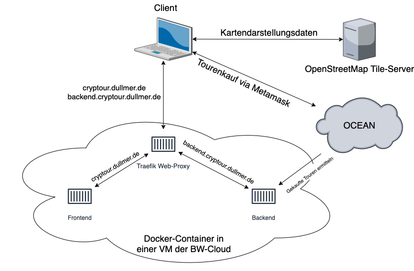

# Dokumentation

## Projektmanagement
Alle Dokumente zum Projektmanagement liegen im Ordner [allgemein](https://github.com/Cryp-Tour/dokumentation/tree/main/allgemein).

## Infrastruktur

## CI/CD
Änderungen im Main-Branch werden automatisch mittels Github Actions auf den Server übertragen (website und server Repo). Dafür wird zunächst von dem veränderten Repo ein Docker Image erstellt. Nachdem das Image erstellt ist wird eine SSH-Verbindung mit dem Webserver aufgebaut und mittels der Docker Compose Datei die neuersten Images heruntergeladen und die veränderten Container neugestartet.

## MetaMask einrichten
Die Schritte zum einrichten von MetaMask sind in folgender Datei zu finden: [MetaMask einrichten](https://github.com/Cryp-Tour/website/blob/main/Readme.md)

## Frontend
Der Code vom Frontend ist im Repo [website](https://github.com/Cryp-Tour/website) zu finden.

Die Dokumentation zum Frontend befindet sich in folgender Datei: [Fontend Doku](/frontend/README.md)

## Backend
Der Code vom Backend ist im Repo [server](https://github.com/Cryp-Tour/server) zu finden.

Die Dokumentation zum Backend befindet sich in folgender Datei: [Backend Doku](/backend/README.md)
