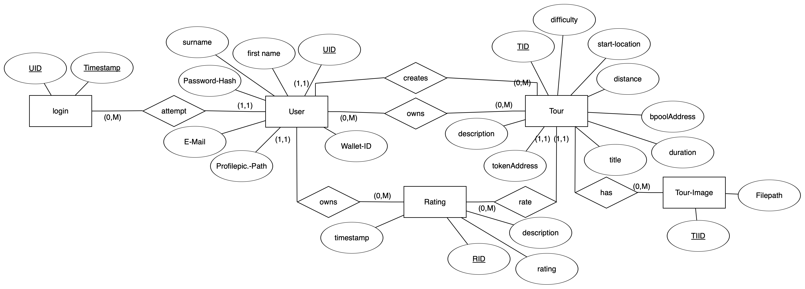

# Backend

## Datenbank
Als Datenbank wird SQLite verwendet. Die Datenbankstruktur ist in folgendem Bild dargestellt.

## REST-API Dokumentation
Die REST-API des Backends ist mittels einer [openapi.yaml](https://github.com/Cryp-Tour/dokumentation/blob/main/backend/openapi.yaml) Datei definiert und dokumentiert. Damit die Dokumentation benutzerfreundlich gelesen werden kann ein [Online-Viewer](https://editor.swagger.io) verwendet werden indem die URL https://raw.githubusercontent.com/Cryp-Tour/dokumentation/main/backend/openapi.yaml importiert wird.

## Kommentare für die Funktionen am Server
Da die REST-API mittels der OpenAPI.yaml Datei dokumentiert ist und alle Funktionen dafür ein einheitliches Namensschema haben, entfählt die Kommentierung dieser Funktionen.

## Ordnerstruktur und Dateien

---
### .github/workflows
Enthält die Workflow-Dateien für die Ausführung der Github Actions.

---
### .vscode
Konfig-Datei zum einfacheren Starten des Nodejs-Servers in VSCode.

---
### API/controllers/*
Enthält Funktionen die für die Datei API/routes/testRoute.js benötigt werden.

### API/lib/*
Hilfreiche Funktionen für die Fehlerbehandlung und dem Dateiumgang.

### API/index.js
Erstellt die Hauptrouten für die Touren und Benutzer, sowie der 404 Fehlermeldung.

### API/routes/testRoute.js
Route die Verwendet werden kann, um zu testen ob die REST-API erreichbar ist.

### API/routes/tours.js
Enthält alle Routen / Endpoints die für Touren verfügbar sind. Alle Endpoints rufen dann die datenverarbeitenden Funktionen in API/services auf. Diese Funktionen überprüfen auch, ob ein Benutzer eingeloggt ist.

### API/routes/user.js
Enthält alle Routen / Endpoints die für Benutzer verfügbar sind. Alle Endpoints rufen dann die datenverarbeitenden Funktionen in API/services auf. Diese Funktionen überprüfen auch, ob ein Benutzer eingeloggt ist.

### API/services/tours.js
Enthält alle datenverarbeitenden Funktionen für Touren.

### API/services/user.js
Enthält alle datenverarbeitenden Funktionen für Benutzer.

---
### contracts/*
JSON-Dateien mit Rinkerby Contracts. Für den Kauf benötigt.

---
### data/*
Hier werden die Bilder und GPX-Dateien für jede Tour abgelegt. Dazu bekommt jede Tour einen Ordner. Der Ordnername ist die TourID.

---
### db/dbo.js
JS-Klasse die die Arbeit mit SQLite Datenbank vereinfacht. Erstellt die Tabellen falls sie nicht exestieren und hat funktionen, um SQL-Befehle auszuführen.

---
### .env
Environment Variablen die für die erkennung von Tourkäufen benötigt wird.

### Dockerfile
Enthält die Konfiguration, um aus dem Server Repo ein Docker Image zu erstellen.

### docker-compose.yaml
Ist die Docker-Compose Datei die sich auf dem Server befindet und die Container für das Frontend und Backend startet.

### *-Manager.js
Funktionen die den Umgang mit Ordnern, GPX-Dateien, Bildern, Benutzern und Crypto vereinfacht und häufiger in verschiedenen Routen der REST-API benötigt werden.

### package-lock.json & package.json & server.js
Dateien, damit der Nodejs-Webserver läuft, um das Backend bereitzustellen.
